# Assessing and Improving the Generalizability of Text-to-3D Models using Cap3D


**Course:** CMPT 420/728 Deep Learning · Simon Fraser University  
**Authors:** Archita Srivastava · Mohammad Taghizadeh · Sydney Widjaja  
**[Slides](https://docs.google.com/presentation/d/1gyMfiqhIgP-06eg5-a6JMS4QSEVXrBHW5OIouFKaDYU/edit?usp=sharing) · [Project Report](https://www.overleaf.com/read/htkfbmdphxkh#9963b5) · [GitHub](https://github.com/Archita93/AIGM-Cap3D)**

---

## Overview

Text-to-3D generation remains one of the most challenging frontiers in generative AI. Key obstacles include the scarcity of high-quality text-3D paired data, reliance on synthetic data and 2D image-text knowledge to infer 3D structure, and the **Janus problem** — where models lack global geometric coherence and produce view-inconsistent shapes.


This project investigates these limitations by evaluating and fine-tuning three publicly available text-to-3D models on the [Cap3D](https://github.com/crockwell/Cap3D) dataset — a large-scale collection of 3D objects from Objaverse paired with detailed natural language captions.

**Research Questions:**
> 1. How do current text-to-3D architectures struggle with semantic-geometric alignment under zero-shot conditions?
> 2. Does fine-tuning on detailed natural language descriptions allow for "open-vocabulary" reliability when encountering complex prompts?

---

## Models

<div align="center">

| Model | Source | Fine-Tuned |
|---|---|---|
| **Shap-E** | OpenAI / Hugging Face | Yes |
| **Point-E** | OpenAI / Hugging Face | Yes |
| **Fantasia3D** | Hugging Face | Zero-shot only |

</div>


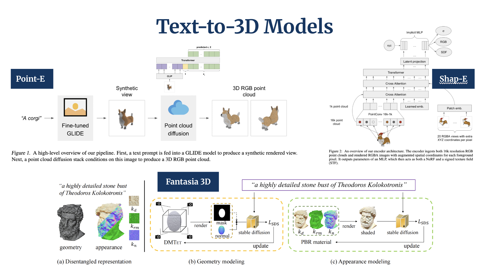

---

## Dataset

**Cap3D** was chosen for its large-scale captioned 3D data, enabling an in-depth analysis of how richer natural language descriptions affect text-to-3D semantic alignment. It provides per-object captions generated from multi-view renders of Objaverse assets using BLIP-2 and GPT-4.

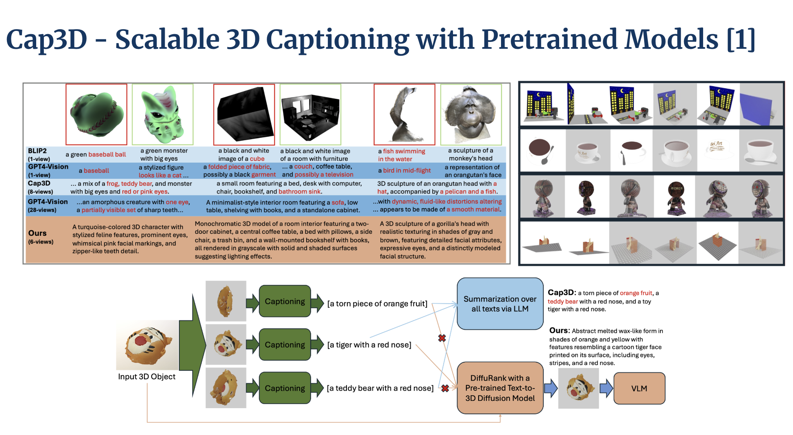

**Sample:**

| Object | Caption |
|:---:|---|
| 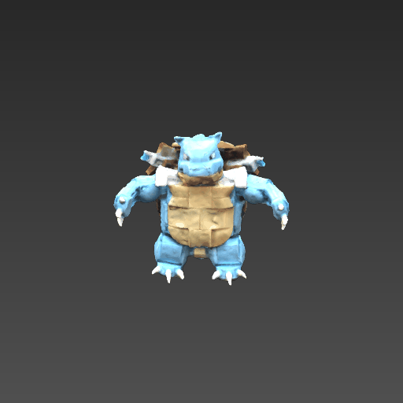 | *"A blue, dinosaur-like creature with a segmented brown shell on its back, detailed with claws on its limbs and tail."* |

---

## Setup & Installation

> The following setup instructions apply to the **Shap-E** pipeline. Point-E and Fantasia3D were evaluated separately using their respective repositories.

**Prerequisites:** Python 3.12.3 · CUDA-compatible GPU · [Blender 3.3.1](https://www.blender.org/download/releases/3-3/)

```bash
git clone https://github.com/Archita93/AIGM-Cap3D.git
cd AIGM-Cap3D
pip install -r requirements.txt

# Shap-E setup
cd src/shap-e-zeroshot/shap-e
pip install -e .
```

---

## How to Run

All scripts are located in `src/shap-e-zeroshot/`.

```bash
# 1. Prepare the dataset
python data.py

# 2. Zero-shot inference (baseline)
python inference-zero-shot.py

# 3. Fine-tune the model
python fine-tune.py

# 4. Inference with fine-tuned model
python inference-post-train.py

# 5. Evaluate results
python eval.py

# 6. Render / view generated shapes
python view.py
```

---

## Methodology

Shap-E was fine-tuned using selective parameter tuning — only the final transformer blocks and text-latent projection layers were updated to preserve pre-trained 3D priors while adapting to Cap3D captions.

### Zero-Shot
- **Guidance Scale:** 17.5 · **Num Steps:** 64 · **Sigma Range:** 1e-3 to 160 · **Eval Set:** N = 100

### Fine-Tuning
- **LR:** 1 × 10⁻⁵ · **Batch Size:** 8 · **Epochs:** 15 · **Split:** 80/20

### Training Curve
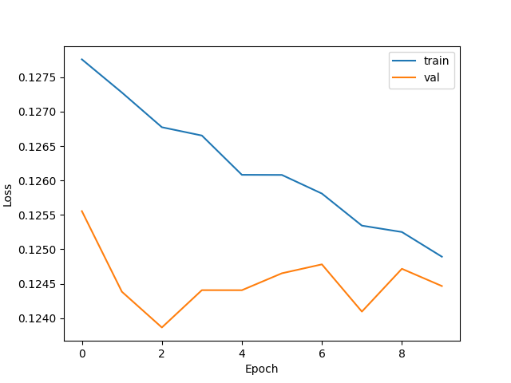

---
## Results

<table>
<tr>
<td>

### Shap-E
| Metric | Zero-Shot | Fine-Tuned | Delta | Category |
|---|---|---|---|---|
| Chamfer Distance ↓ | 0.0334 | 0.0335 | +0.0001 | Geometry |
| F-Score ↑ | 0.0796 | **0.0827** | +0.0031 | Geometry |
| CLIP Score ↑ | 0.2519 | 0.2509 | -0.0010 | Semantic |
| CLIP Similarity ↑ | 0.8106 | **0.8137** | +0.0031 | Semantic |
| R-Precision ↑ | 0.1600 | 0.1600 | +0.0000 | Semantic |
| LPIPS ↓ | 0.2624 | 0.2633 | +0.0009 | Perceptual |

</td>
<td>

### Fantasia3D (Zero-Shot Only)
| Metric | Zero-Shot | Category |
|---|---|---|
| Chamfer Distance ↓ | 0.4912 | Geometry |
| F-Score ↑ | 0.0046 | Geometry |
| CLIP Score ↑ | 0.1902 | Semantic |
| CLIP Similarity ↑ | 0.7450 | Semantic |
| LPIPS ↓ | 0.3206 | Perceptual |

</td>
</tr>
</table>

<div align="center">

### Point-E
| Metric | Zero-Shot | Fine-Tuned | Delta | Category |
|---|---|---|---|---|
| Chamfer Distance ↓ | 0.0079 | **0.0071** | -0.0008 | Geometry |
| CLIP Score ↑ | 0.2650 | **0.2970** | +0.0320 | Semantic |
| CLIP Similarity ↑ | 0.9550 | **0.9560** | +0.0010 | Semantic |

</div>

Fine-tuning shows the clearest gains for **Point-E** (CLIP Score +0.032, Chamfer Distance -0.0008). **Shap-E** sees modest geometric improvements (F-Score +0.0031) with marginal semantic change. **Fantasia3D** underperforms on geometric metrics, reflecting its sensitivity to optimization stability.

---

## Qualitative Comparison

Ground truth, zero-shot, and fine-tuned 3D generations conditioned on the original Cap3D caption.

| Caption | Ground Truth | Zero-Shot | Fine-Tuned |
|---|:---:|:---:|:---:|
| Human lungs with the trachea and bronchi visible. | 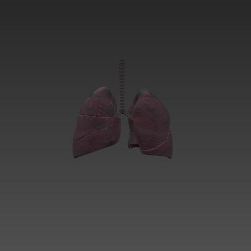 | 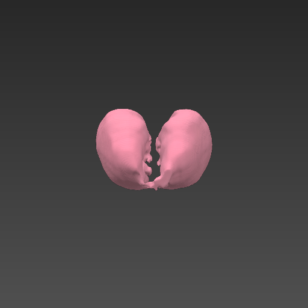 | 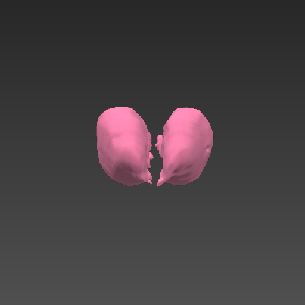 |
| A small indoor space with yellowish walls, a tiled ceiling, and a carpeted floor containing office furniture and equipment. | 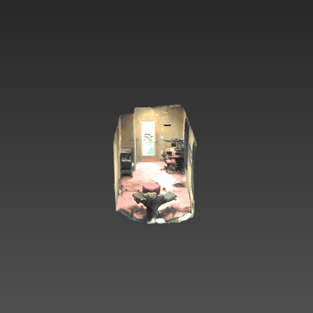 | 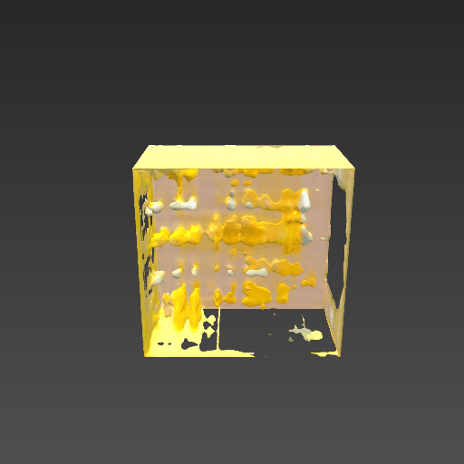 | 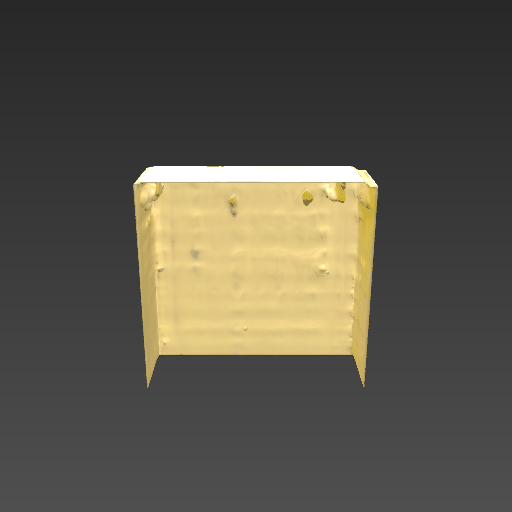 |
| A black dragon with wings and a horned skull. | 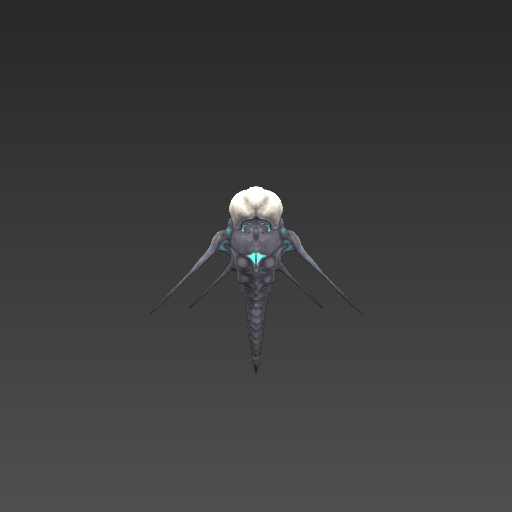 | 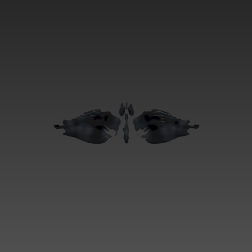 | 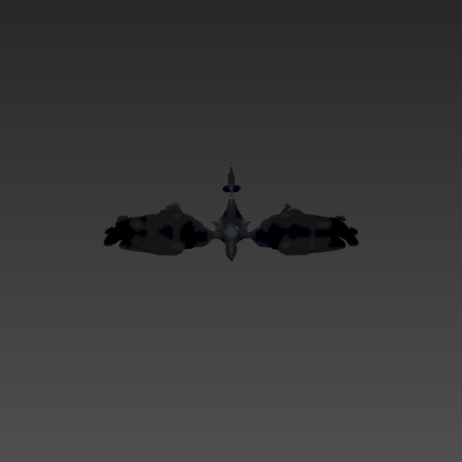 |

---

## Directory Structure

```
AIGM-Cap3D/
├── src/
│   └── shap-e-zeroshot/
│       ├── generated/                    # Zero-shot generated meshes
│       ├── graphs/                       # Training loss curves
│       ├── latents/                      # Encoded shape latents
│       ├── predicted_previews/           # Zero-shot preview renders
│       ├── predicted_previews_finetuned/ # Fine-tuned preview renders
│       ├── predicted_previews_guidance/  # Guidance zero-shot renders
│       ├── previews_gif/                 # Ground truth preview renders
│       ├── scripts/
│       │   ├── data.py                   # Dataset preparation
│       │   ├── eval.py                   # Evaluation metrics
│       │   ├── fine-tune.py              # Fine-tuning pipeline
│       │   ├── inference-post-train.py   # Fine-tuned model inference
│       │   ├── inference-zero-shot.py    # Zero-shot baseline inference
│       │   └── view.py                   # Render / visualize shapes
│       ├── shap-e/                       # Shap-E submodule (OpenAI)
│       ├── shap_e_model_cache/           # Cached weights (not tracked)
│       ├── comparison.ipynb              # Visual comparison notebook
│       ├── eval_results_finetuned.csv
│       └── eval_results_zeroshot.csv
├── cap3d_splits.py
├── downloaded_objects_split.json         
├── requirements.txt
└── .gitignore
```

---

## References

- \[1\] Tiange Luo et al. *Cap3D: Scalable 3D Captioning with Pretrained Models.* 2023. [arXiv:2306.07279](https://arxiv.org/abs/2306.07279)
- \[2\] Alex Nichol et al. *Point-E: A System for Generating 3D Point Clouds from Complex Prompts.* 2022. [arXiv:2212.08751](https://arxiv.org/abs/2212.08751)
- \[3\] Heewoo Jun and Alex Nichol. *Shap-E: Generating Conditional 3D Implicit Functions.* 2023. [arXiv:2305.02463](https://arxiv.org/abs/2305.02463)
- \[4\] Rui Chen et al. *Fantasia3D: Disentangling Geometry and Appearance for High-quality Text-to-3D Content Creation.* 2023. [arXiv:2303.13873](https://arxiv.org/abs/2303.13873)
- \[5\] Objaverse: [https://objaverse.allenai.org](https://objaverse.allenai.org)
